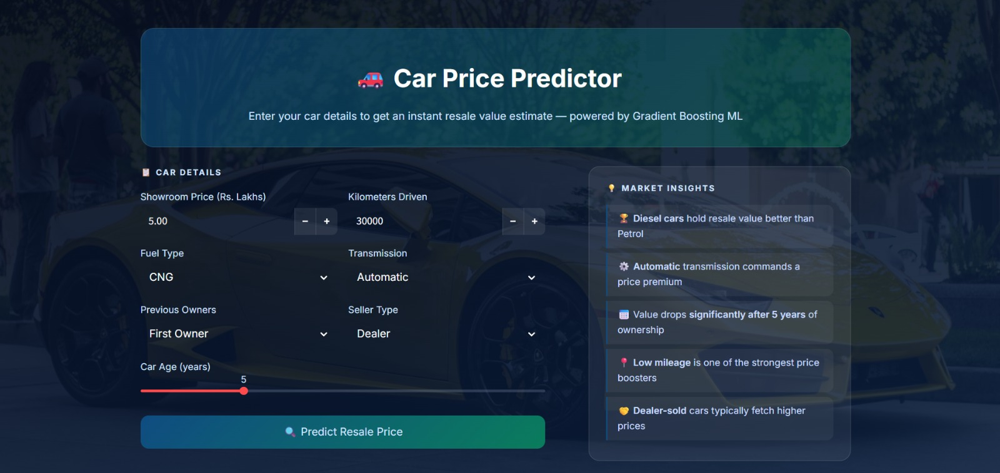
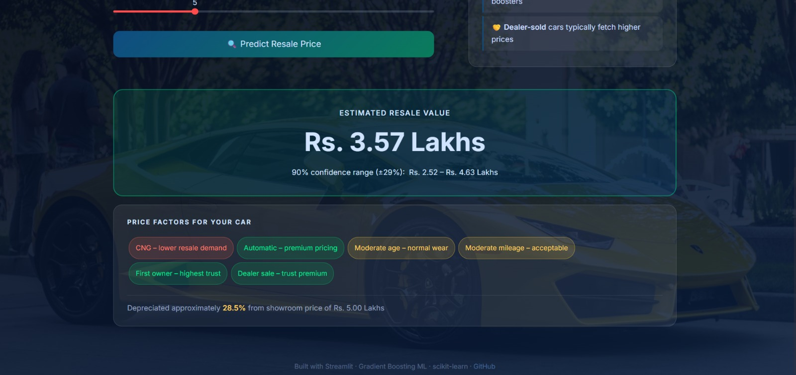

<div align="center">

# 🚗 Car Price Predictor

**Predict the resale value of used cars instantly — powered by Gradient Boosting ML with a dark glassmorphism Streamlit UI.**

[](https://car-price-predictor-cbcpj8vapmz7c6lfyen3fx.streamlit.app/)
[](https://www.python.org/)
[](https://scikit-learn.org/)
[](https://streamlit.io/)
[](LICENSE)

</div>

---

## 🖥️ App Preview

| Home | Prediction Result |
|:----:|:-----------------:|
|  |  |

---

## ✨ Features

| Feature | Description |
|---------|-------------|
| 🔮 **Instant Prediction** | Resale price estimate in Rs. Lakhs with one click |
| 📊 **90% Confidence Range** | Bootstrap-derived prediction interval (not a hardcoded %) |
| 🏷️ **Smart Factor Pills** | Highlights what's boosting or hurting your car's resale value |
| ⚠️ **Input Validation** | Contextual warnings for unusual input combinations |
| 💡 **Market Insights** | Curated panel of Indian used-car resale tips |
| 🎨 **Dark Glassmorphism UI** | Random car background with frosted-glass cards |
| 🔁 **Auto-Training Script** | `train_model.py` regenerates all `.pkl` files from scratch |

---

## 🧠 ML Pipeline

| Step | Details |
|------|---------|
| **Dataset** | 301 rows · 9 features — Indian used car sales data |
| **Preprocessing** | LabelEncoder for Fuel Type, Seller Type, Transmission |
| **Feature Engineering** | `Car_Age = 2024 − Year` to capture depreciation |
| **Models Compared** | Linear Regression · Ridge · Random Forest · **Gradient Boosting** ✅ |
| **Best Model** | `GradientBoostingRegressor(n_estimators=200, learning_rate=0.05, max_depth=4)` |
| **Evaluation** | R² · RMSE · MAE on 20% hold-out + 5-fold cross-validation |
| **Prediction Interval** | Bootstrap resampling of test residuals (1000 iterations, 90th-percentile) |

---

## 📈 Model Performance

| Metric | Score |
|--------|:-----:|
| R² Score (test set) | ~0.97 |
| RMSE | ~0.81 Lakhs |
| MAE | ~0.53 Lakhs |
| CV R² (5-fold) | ~0.51 ± 0.70 |
| Prediction Interval | ±29.5% for 90% coverage |

> Full evaluation, learning curves, and SHAP analysis are in `Car_Price_Predictor.ipynb`

---

## 📁 Project Structure

```
Car-Price-Predictor/
│
├── app.py                      # Streamlit web application
├── train_model.py              # Standalone training script
├── Car_Price_Predictor.ipynb   # Full ML notebook (EDA → training → evaluation)
├── car_data.csv                # Raw dataset (301 records)
│
├── encoders/                   # Auto-generated (gitignored)
│   ├── le_fuel.pkl
│   ├── le_seller.pkl
│   └── le_transmission.pkl
│
├── car_price_model.pkl         # Auto-generated (gitignored)
├── screenshots/                # App screenshots
├── requirements.txt
├── .gitignore
└── README.md
```

> **Note:** `.pkl` files are gitignored. Run `python train_model.py` to regenerate them.

---

## 🚀 Quick Start

```bash
# 1. Clone
git clone https://github.com/kananiisha/Car-Price-predictor.git
cd Car-Price-predictor

# 2. Install dependencies
pip install -r requirements.txt

# 3. Train the model (generates car_price_model.pkl + encoders/)
python train_model.py

# 4. Launch the app
streamlit run app.py
```

---

## 🔢 Input Features

| Feature | Type | Description |
|---------|------|-------------|
| Showroom Price | Float | Original ex-showroom price (Rs. Lakhs) |
| Kilometers Driven | Integer | Total distance covered |
| Fuel Type | Categorical | Petrol / Diesel / CNG |
| Seller Type | Categorical | Dealer / Individual |
| Transmission | Categorical | Manual / Automatic |
| Previous Owners | Integer | 0 (first owner) to 3 |
| Car Age | Integer | Derived: current year − manufacturing year |

---

## ⚠️ Known Limitations

| Limitation | Details |
|------------|---------|
| **Small dataset** | Trained on 301 records — high test R² alongside wide CV variance signals overfitting |
| **Indian market only** | Prices in Rs. Lakhs; not calibrated for other markets |
| **Fixed year reference** | `Car_Age` uses 2024 as base — retraining needed as time progresses |
| **Limited features** | Lacks brand, city, condition, service history — all real-world price drivers |

---

## 🛠️ Tech Stack

| Layer | Technology |
|-------|-----------|
| Language | Python 3.10+ |
| ML Model | GradientBoostingRegressor (scikit-learn) |
| Encoders | LabelEncoder (scikit-learn) |
| Data | Pandas · NumPy |
| Visualisation | Matplotlib · Seaborn · Plotly · SHAP |
| App | Streamlit |
| Styling | Custom CSS (glassmorphism dark theme) |

---

## 📄 License

[MIT License](LICENSE) — free to use and modify.

---

<div align="center">

**Built with ❤️ using Streamlit + Gradient Boosting**

[🌐 Live Demo](https://car-price-predictor-cbcpj8vapmz7c6lfyen3fx.streamlit.app/) &nbsp;·&nbsp; [📓 Notebook](Car_Price_Predictor.ipynb) &nbsp;·&nbsp; [🐛 Issues](https://github.com/kananiisha/Car-Price-predictor/issues)

</div>
